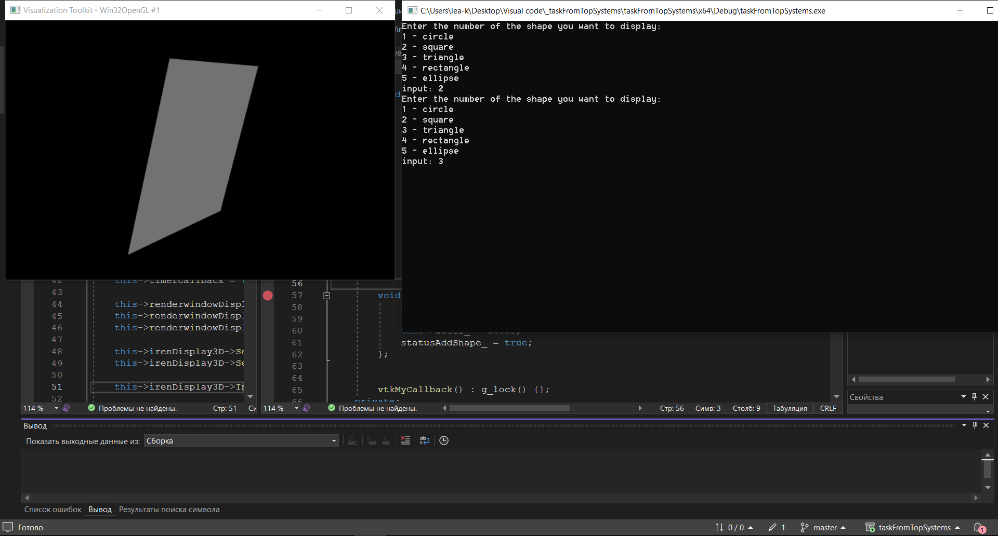
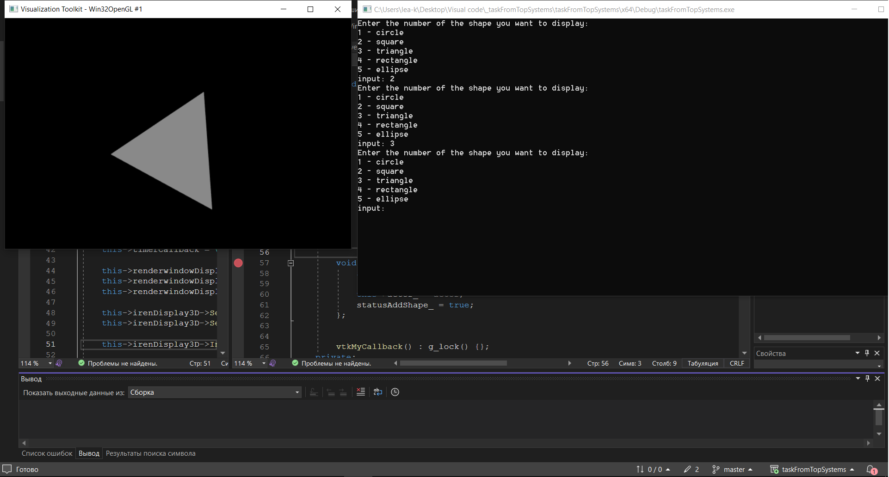

# Task from TopSystems
## **_Задание:_**

    Необходимо привести пример программы или библиотеки на C++, которая выводит на экран различные геометрические фигуры : круг, квадрат, треугольник, прямоугольник и т.п.
    Глубина проработки примера(количество фигур, параметры, методы) на Ваше усмотрение. Программа не обязательно должна запускаться и работать(хотя это будет плюсом).
    В задании Вам необходимо продемонстрировать умение использовать ООП.
    Просим не пользоваться библиотекой QT при выполнении задания.

## Описания решения 

Для выполнения последнего пункта задания проект собран в VS с использованием библиотек VTK - средство визуализации, и OpenCascade - построение 3D объектов.

Проект реализован с подходом проектирования Event Loop

Проект состоит из классов:
* EventLoop - главный класс, реализующий обработку цикла событий 
* MakerPrimitive - класс, реализцющий 3D примитивы
* ViewWndow - класс отображения (выполняется в отдельном потоке)
* CLI - класс обработки команд с консоли

## Сборка проета
Проеет зависит от библиотек [VTK 6.1.0](https://dev.opencascade.org/resources/download/3rd-party-components) и [OpenCascade](https://github.com/Open-Cascade-SAS/OCCT).

Для работы OpenCascade (OCC) с VTK необходимо собрать библиотеку OCC с влюченным модулем VTK (в данном модуле реализованы алгоритмы преобразования TopoShape в vtkShape).

1. Скачать источники [OCC](https://github.com/Open-Cascade-SAS/OCCT).
2. Скачать зависимости ([freeimage-3.17.0](https://dev.opencascade.org/resources/download/3rd-party-components) [freetype-2.5.5](https://dev.opencascade.org/resources/download/3rd-party-components) [tcltk-86](https://dev.opencascade.org/resources/download/3rd-party-components) [VTK-6.1.0](https://dev.opencascade.org/resources/download/3rd-party-components)).
3. Создать проект сборки в СMake со влюченным флагом USE_VTK.
4. Клонировать данный репозитарий на свой пк.
5. Добавить в дополнительные каталоги включаемых файлов: OpenCascade_install\inc (Собранная библиотека) и vtk\inc.
6. Добавить в дополнительные каталоги библиотек OpenCascade_install\win64\vc14\lib и vtk\lib.
7. В дополнительные зависимости добавить:

    TKernel.lib; TKMath.lib; TKG3d.lib; TKBRep.lib; TKGeomBase.lib; TKGeomAlgo.lib; TKTopAlgo.lib; TKPrim.lib; TKBO.lib; TKBool.lib;TKOffset.lib; TKService.lib; TKV3d.lib; TKOpenGl.lib; TKFillet.lib; TKXSBase.lib; TKG2d.lib; TKG3d.lib; TKTopAlgo.lib; TKGeomBase.lib; TKSTEP209.lib; TKSTEPAttr.lib; TKSTEPBase.lib; TKSTep.lib; TKXmlXCAF.lib; TKXCAF.lib;
8. Добавить в переменные окуржения путь до OpenCascade_install\win64\vc14\bin и vtk\bin, freetype-2.5.5\bin

## Замечания
В Event Loop реализовано сообщение Exit, однако при вызове vtkRenderWindowInteractor::TerminateApp() или vtkRenderWindowInteractor::TermiExitCallback() в потоке в котором исполняется ViewWndow происходит ошибка "wglMakeCurrent failed in MakeCurrent()". При обычном завершении приложения (закрыть окно приложения), ошибок замечено не было.

Вероятнее всего ошибка связана с моим плохим знакомством с VTK.

В ViewWndow реализован CallBack класс, при работе с потоками используются mutex-ы для обеспечения потокобезопасности.